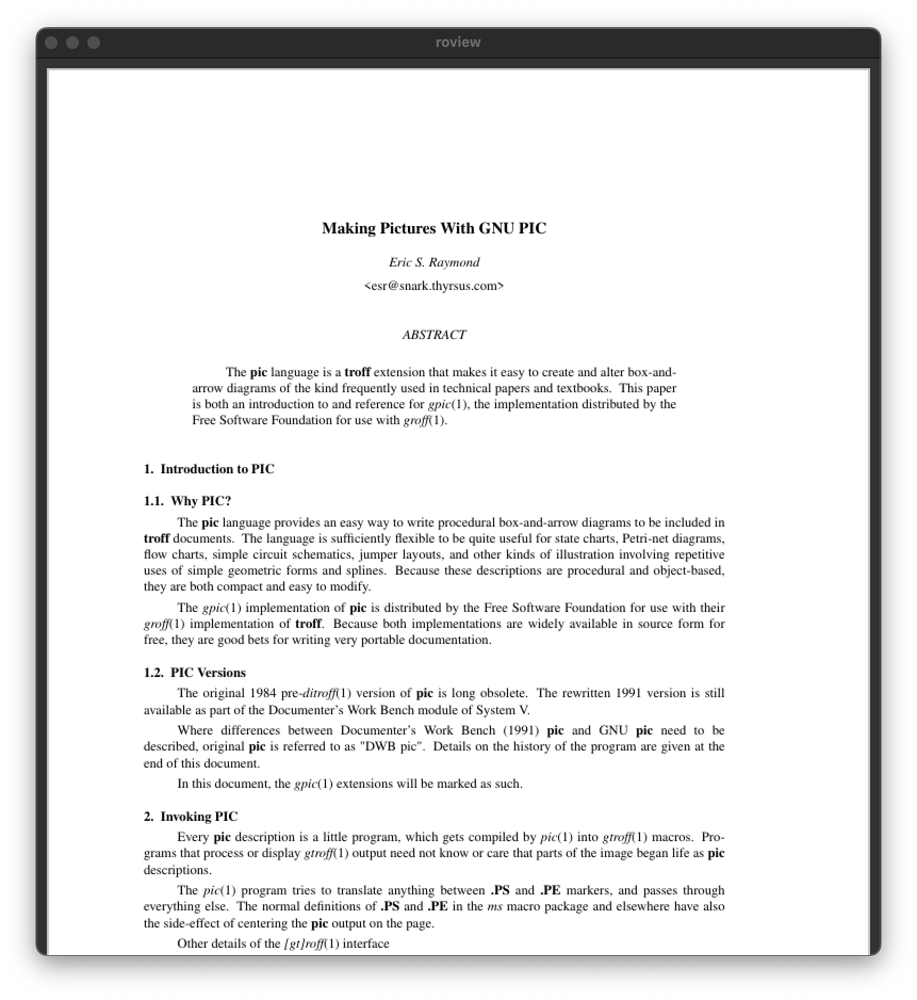

# roview
A simple PDF viewer writren in C using MuPDF and Raylib

# Features
- View PDF files
- Zoom in and out
- Go to page

# Purpose
The purpose of this project is to provide a simple PDF viewer that can be used to view PDF files.
It is designed to be lightweight and easy to use, with a focus on simplicity and functionality.

# Requirements
- C17 compliant compiler
- [Raylib](https://www.raylib.com/) (v5.0 or later)
- [MuPDF](https://mupdf.com/) (v1.23.0 or later)